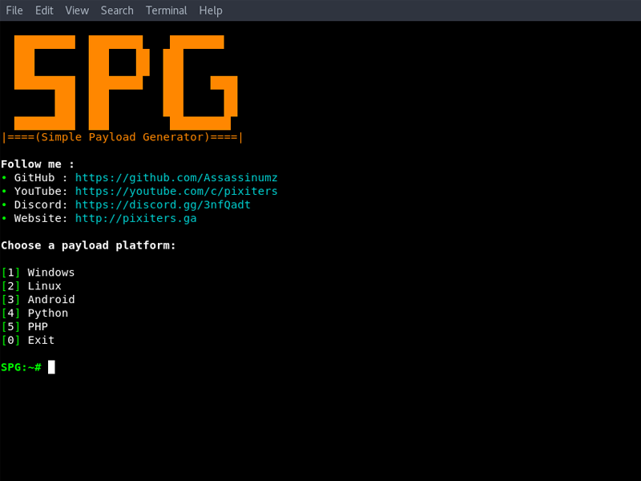

<h1  align="center">Simple Payload Generator</h1>

<p  align="center">
 Simple Payload Generator (SPG) simplifies the job of creating payloads with MSFVenom
</p>

<p align="center">
  <a href="https://discord.gg/3nfQadt">
    
  </a>
  </p>


## DISCLAIMER

<p  align="center">

TO BE USED FOR LEARNING PURPOSES ONLY

</p>

  

THIS SOFTWARE IS PROVIDED "AS IS" WITHOUT WARRANTY OF ANY KIND. YOU MAY USE THIS SOFTWARE AT YOUR OWN RISK. The use of this software Simple Payload Generator(SPG) is COMPLETE RESPONSIBILITY of the END-USER. Developers assume NO liability and are NOT responsible for any misuse or damage caused by this program.

  

IN NO EVENT SHALL THE COPYRIGHT HOLDER OR CONTRIBUTORS BE LIABLE

FOR ANY DIRECT, INDIRECT, INCIDENTAL, SPECIAL, EXEMPLARY, OR CONSEQUENTIAL

DAMAGES (INCLUDING, BUT NOT LIMITED TO, PROCUREMENT OF SUBSTITUTE GOODS OR

SERVICES; LOSS OF USE, DATA, OR PROFITS; OR BUSINESS INTERRUPTION) HOWEVER

CAUSED AND ON ANY THEORY OF LIABILITY, WHETHER IN CONTRACT, STRICT LIABILITY,

OR TORT (INCLUDING NEGLIGENCE OR OTHERWISE) ARISING IN ANY WAY OUT OF THE USE

OF THIS SOFTWARE, EVEN IF ADVISED OF THE POSSIBILITY OF SUCH DAMAGE. Taken from [LICENSE](LICENSE).

  

## PREREQUISITES

* Python 2.7

*  [Metasploit-Framework](https://github.com/rapid7/metasploit-framework)

  

## TESTED ON

*  **Kali Linux - Rolling Edition**

## INSTALLATION
```

git clone https://github.com/Assassinumz/simple-payload-generator.git

cd simple-payload-generator

python spg.py

```
## VIDEO TUTORIAL

<div  align="center">

<a  href="https://youtu.be/xPR_Wyb-Dnk"></a>

</div>

  

## AVALAIBLE PAYLOADS

  

#### Windows

* windows/meterpreter/reverse_http

* windows/meterpreter/reverse_https

* windows/meterpreter/reverse_tcp

  

#### Linux

* linux/x86/shell/reverse_tcp

* linux/x86/meterpreter/reverse_tcp

  

#### Android

* android/meterpreter/reverse_http

* android/meterpreter/reverse_https

* android/meterpreter/reverse_tcp

  

#### Python

* python/meterpreter/reverse_http

* python/meterpreter/reverse_https

* python/meterpreter/reverse_tcp

  

#### PHP

* php/meterprter/reverse_tcp

## HAVE ANY QUESTIONS ?

 - Ask me on [Discord](https://discord.gg/3nfQadt)

